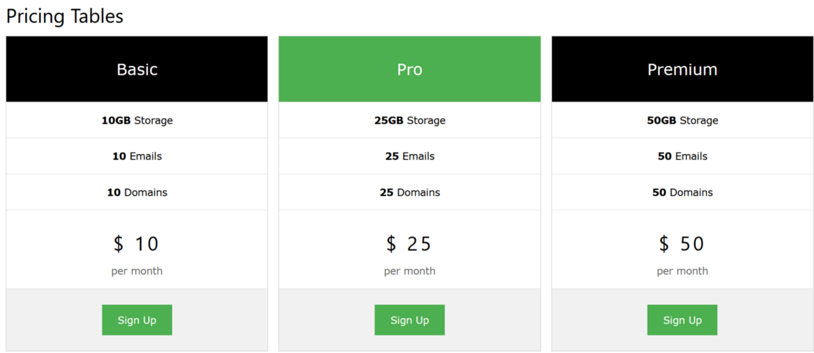
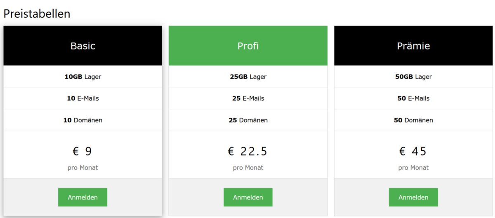

# Node.js Tutorial on Creating a Multilingual Web App
This repository contains the source code for creating a multilingual web application in Node.js, without the need to install any external localization or internationalization library.

# Glob
Glob is a library to match files using the patterns the shell uses, such as stars and stuff.

    npm install glob

# Language Files
Language files will be stored in the JSON data format, which is convertible into JavaScript objects.

```js
{
  "pricing_table": "Pricing Tables",
  "basic": "Basic",
  "pro": "Pro",
  "premium": "Premium",
  "storage": "Storage",
  "email": "Emails",
  "domain": "Domains",
  "sign_up": "Sign Up",
  "cost_basic": "$ 10",
  "cost_pro": "$ 25",
  "cost_premium": "$ 50",
  "per_month": "per month"
}
```

# Index.js
This is the main file for your Node.js server.

```js
var fs = require('fs');
var http = require('http');
var url = require('url');
var glob = require( 'glob' );
var language_dict = {};

glob.sync( './language/*.json' ).forEach( function( file ) {
  let dash = file.split("/");
  if(dash.length == 3) {
    let dot = dash[2].split(".");
    if(dot.length == 2) {
      let lang = dot[0];
      fs.readFile(file, function(err, data) {
        language_dict[lang] = JSON.parse(data.toString());
      });
    }
  }
});

http.createServer(function (req, res) {
  var q = url.parse(req.url, true);
  var lang = 'en';
  let dash = q.pathname.split("/");
  if(dash.length >= 2) {
    let code = dash[1];
    if(code !== '' && language_dict.hasOwnProperty(code)) {
      lang = code;
    }
  }

  fs.readFile('index.html', function(err, data) {
    res.writeHead(200, {'Content-Type': 'text/html; charset=utf-8'});
    let data_string = data.toString()
    for (var key of Object.keys(language_dict[lang])) {
      let pattern = new RegExp("{{" + key + "}}", "g");
      data_string = data_string.replace(pattern, language_dict[lang][key]);
    }
    res.write(data_string);
    return res.end();
  });
}).listen(8080);
```

# Running Node.js server

    node index.js

# Loading the web app in your browser
Simply modify the url based on the language code.

    http://localhost:8080/en



For German internationalization, go to the following url

    http://localhost:8080/de


